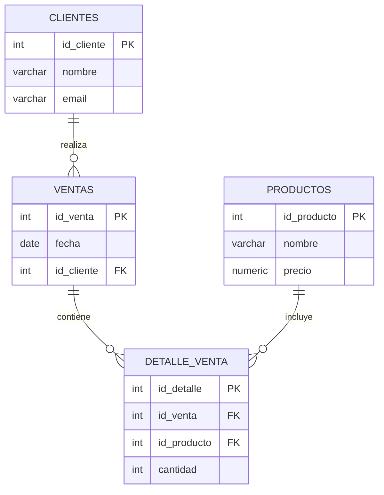

# 🛒 Sistema de Ventas - SQL Challenger

## 📌 1. Descripción del proyecto

Este proyecto consiste en el diseño e implementación de una base de datos para una tienda de tecnología.

El sistema permite registrar y gestionar:

* Clientes registrados
* Productos disponibles
* Ventas realizadas
* Detalle de productos vendidos en cada venta

El objetivo principal es poder responder preguntas de negocio como:

* ¿Qué clientes compran más?
* ¿Qué productos se venden más?
* ¿Cuántas ventas se realizan?
* ¿Qué ventas incluyen más de un producto?
* ¿Qué clientes han comprado múltiples veces?

---

## 🛠️ 2. Tecnologías utilizadas

* PostgreSQL
* SQL (Structured Query Language)

---

## ⚙️ 3. Instrucciones de uso

### 1. Crear la base de datos

Primero debes crear una base de datos en PostgreSQL:

```sql
CREATE DATABASE sistema_ventas;
```

Luego conéctate a ella:

```sql
\c sistema_ventas;
```

---

### 2. Ejecutar schema.sql

Este archivo crea todas las tablas necesarias:

```sql
\i schema.sql
```

---

### 3. Ejecutar seed.sql

Este archivo inserta datos de prueba:

```sql
\i seed.sql
```

---

### 4. Ejecutar report.sql

Este archivo contiene todas las consultas del challenger:

```sql
\i report.sql
```

---

## 🗂️ 4. Estructura del proyecto

```
sql-sistema-ventas/
│
├── schema.sql
├── seed.sql
├── report.sql
└── README.md
```

---

## 🧩 5. Modelo de datos (Diagrama ER)



---

## 📊 6. Funcionalidades implementadas

El archivo `report.sql` incluye consultas que permiten:

### 🔹 Consultas básicas

* Listar clientes, productos y ventas
* Mostrar columnas específicas

### 🔹 Filtros y ordenamiento

* Filtrar por precio, fecha y cantidad
* Ordenar resultados

### 🔹 Funciones de agregación

* Conteo de registros
* Promedios
* Sumas

### 🔹 JOINs

* Relación entre clientes, ventas y productos

### 🔹 Análisis con GROUP BY y HAVING

* Clientes con más compras
* Productos más vendidos
* Ventas con múltiples productos

### 🔹 Consulta trampa

* Ejemplo de consulta válida que no retorna resultados

---

## 🎯 7. Objetivo del challenger

Este ejercicio permite desarrollar habilidades en:

* Modelamiento de bases de datos
* Escritura de consultas SQL
* Análisis de datos
* Resolución de problemas de negocio

---

## 🚀 8. Bonus (opcional)

Se pueden agregar consultas adicionales como:

* Producto más caro
* Cliente con más compras
* Fecha con mayor número de ventas

---

## 👥 9. Trabajo colaborativo

Este proyecto fue desarrollado en equipo utilizando GitHub para:

* Control de versiones
* Trabajo colaborativo
* Organización del código

---
